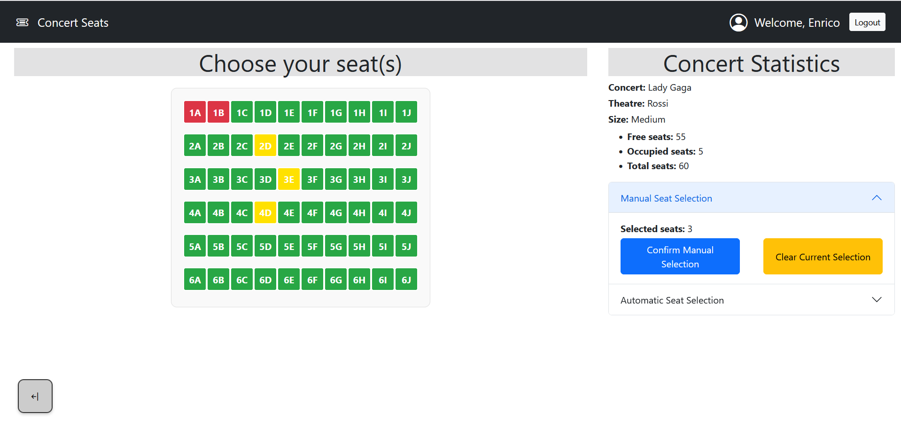

# react_concert-seats

## React Client Application Routes

- Route `/*`: Default route that matches incompatible routes written in the browser.
- Route `/`: Main route of the application that displays the starting elements for a user authenticated and not authenticated, specifically if the user is a guest user he only sees the concerts, if the user is auth sees all the concerts and his own reservations if are present.
- Route `/reservation/:idConcert`: Route to display the page for interact and take a reservation only for user authenticated.
- Route `/login`: Route to display the login form to authenticate the user in the application

## API Server

- GET `/api/concerts`
  - request parameters and request body content : none
  - response body content : an array of objects representing the concerts
  - response body error : a 500 status code error signalling general DB error 
- GET `/api/:idConcert/concerts`
  - request parameters and request body content : the id of a specific concert
  - response body content : an object representing the concert's details also for the theatre in which the concert is held
  - response body error : a 500 status code error signalling general DB error 
- GET `/api/userReservations`
  - request parameters and request body content : none
  - response body content : an array of objects of reservation details for each concert for a specific user, retrieved from the session
  - response body error : a 500 status code error signalling general DB error 
- POST `/api/reservations`
  - request parameters : none
  - request body content : an object containing the id of a concert and an array of seats to be reserved
  - response body content : an object containing the id of the concert for which the reservation was successful
  - response body error : a 422 status code error signalling format errors in the body; a 500 status code error signalling general DB error (a reservation for the user already exist, a seat is repeated or is in an invalid format or a generic error); a 409 status code signalling that one or more requested seats are already reserved
- DELETE `/api/:idConcert/reservations`
  - request parameters : the id of the concert for which a user reservation has to be cancelled
  - response body content : the number of reservation that are cancelled (should be 0 or 1) 
  - response body error : a 422 status code error signalling format errors in the body; a 401 status code error signalling wrong user credentials; a 500 status code error signalling general DB error
- POST `/api/sessions`
  - request parameters and request body content : username and psw of the user that is performing authentication
  - response body content : an object that contains the user details
  - response body error : a 401 status code error for wrong user credentials
- DELETE `/api/sessions/current`
  - request parameters and request body content : none
  - response body content : none
  - response body error : none
- GET `/api/sessions/current`
  - request parameters and request body content : none
  - response body content : an object that contains the user details
  - response body error : a 401 status code error for non authenticated user
- GET `/api/auth-token`
  - request parameters and request body content : none
  - response body content : an object that containing the jwt token for the user
  - response body error : none

## API Server2

- GET `/api/discount`
  - request parameters : none
  - request body content : an array containing the seats for a reservation
  - response body content : an object containing the estimation in percentage of the discount for the next season
  - response body error : a 500 status code error signalling general DB error

## Database Tables

- Table `users` - contains "idUser","email","name","salt","hPassword","loyal"
- Table `theatre_types` - contains "idType","theatreType","rows","columns"
- Table `theatres` - contains "idTheatre","nameTheatre","idType"
- Table `concerts` - contains "idConcert","nameConcert","idTheatre","freeSeats"
- Table `reservations` - contains "idReservation","idUser","idConcert","seat"

## Main React Components

- `App` (in `App.jsx`): is the main entry point of the application, responsible for managing the global state, handling authentication, and fetching initial data. It sets up the main routes using react-router-dom and passes necessary props to the Layout component.
- `Layout` (in `App.jsx`): is the structural layout of the application, rendering the navigation bar and conditionally displaying the main content based on the user's state (whether logged in, with or without a reservation).
- `DefaultRoute` (in `App.jsx`): provides a fallback for any undefined routes, displaying a simple message and a link to redirect users back to the main page, ensuring a user-friendly experience when navigating to invalid URLs.
- `Navigation` (in `navbarComponent.jsx`): provides the top navigation bar for the application, displaying the application title and user-related actions. It conditionally renders user information and authentication buttons based on the logged-in state, and handles logout functionality by invoking the provided doLogout function and navigating to the home page.
- `LoginForm` (in `loginComponent.jsx`): provides a user interface for logging into the application, including input fields for the username and password, and a toggle to show or hide the password. It handles form submission, displays error messages, and uses the provided login function to authenticate the user, navigating to the main page upon successful login.
- `SuccessToast` (in `toastComponent.jsx`): designed to display a toast notification when an action, such as a reservation, is successfully completed. It shows up based on the showToast prop and automatically hides after 5 seconds due to the autohide and delay properties.
- `ErrorToast` (in `toastComponent.jsx`): similarly to SuccessToast, but it is intended for displaying error notifications when an action fails, such as a reservation issue. It shows up based on the showToast prop and automatically hides after 5 seconds due to the autohide and delay properties.
- `MainPage` (in `mainPageComponent.jsx`): This is the main component that manages the display of concerts and user reservations. It retrieves concert data and user reservations and handles updates when changes occur.
- `Concert` (in `mainPageComponent.jsx`): Displays a list of available concerts in a grid format. It highlights whether a user has already reserved a concert.
- `UserReservations` (in `mainPageComponent.jsx`): Displays the user's reservations. If the user is not logged in, it prompts them to log in. If they have reservations, it shows them in an accordion format with details like the number of seats reserved and the ability to delete reservations. It also displays any applicable discounts.
- `MyModal` (in `mainPageComponent.jsx`): This component renders a modal that confirms whether the user wants to permanently cancel a reservation.
- `ConcertDetails` (in `ConcertDetailsComponent.jsx`): This is the main component for the concert details page. It retrieves data about a specific concert and allows users to select seats either manually or automatically. It handles seat selection, statistics updates, and the reservation process.
- `SeatMapComponent` (in `ConcertDetailsComponent.jsx`): This component renders a visual representation of the concert's seating map. It allows the user to select seats by clicking on them, highlighting selected, occupied, or previously reserved seats.
- `StatisticAndConfirmation` (in `ConcertDetailsComponent.jsx`): This component shows concert statistics like free, occupied, and total seats. It allows the user to confirm their seat selection manually or automatically by selecting the number of seats they want to reserve. It also provides the functionality to clear selections.
- `MyModal` (in `ConcertDetailsComponent.jsx`): This modal component is used to confirm seat reservations. It asks the user for confirmation before finalizing the reservation.

## Screenshot

## Users Credentials

- enrico@test.com, pwd, Enrico, 1 (loyal)
- luigi@test.com, pwd, Luigi, 1 (loyal)
- alice@test.com, pwd, Alice, 0 (not loyal)
- harry@test.com, pwd, Harry, 0 (not loyal)

